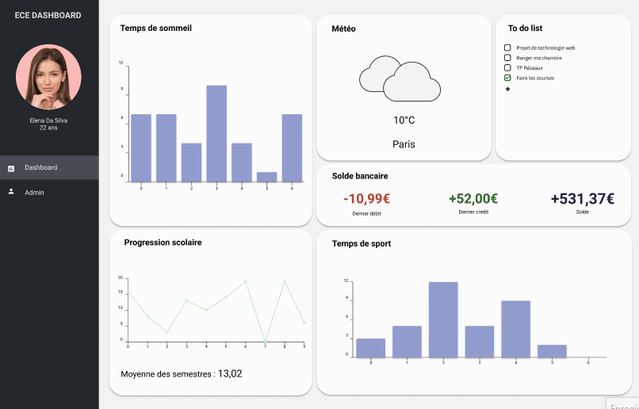

# Projet de fin de semestre

Les consignes du projet se trouvent sur ce [lien](https://github.com/sandratng/PROJECT_WEB_OCRES/blob/master/Projet%20Dashboard.pdf).

**ECE Dashboard** regroupe des widgets utiles pour son **quotidien**. Il y a des widgets pour :  

* :zzz: Voir son **temps de sommeil**  
* :sunny: Connaître la **météo**  
* :scroll: Ecrire sa **to do list**  
* :pencil2: Voir l'évolution de ses **moyennes scolaires**  
* :running: Voir son **temps de sport**  
* :money_with_wings: Surveiller son **solde bancaire**  
* :moneybag: Convertir des **devises**  
* :laughing: Rigoler à des **blagues**  
* :chart_with_upwards_trend: Surveiller les **statistiques de la Covid-19**

## Installation
* Cloner le projet dans un répertoire puis:
### Backend
* Installer mongodb : ``npm install mongodb --save``
* Installer : ``npm i nodemon --save-dev``
* Installer : ``npm i body-parser --save``
* Installer : ``npm install cors --save``
* Installer les dépendances : ``npm install``
* Démarrer le serveur : ``node app``

### Frontend

* Installer les dépendances : ``npm install``
* Installer : ``npm install axios --save``
* Installer : ``npm i styled-components``
* Installer : ``npm i date-fns --save``
* Démarrer le serveur : ``npm start``
* Ouvrir dans votre navigateur : ``localhost::3000``

## Wireframes

Nous avons réalisé les wireframes sur [Figma](https://www.figma.com/file/725LpZHa3Rcj8psK8YnlQs/Projet-Web?node-id=0%3A1).

## Outil de gestion de travail

Nous nous sommes organisés avec l'outil [Trello](https://trello.com/invite/b/XOKOmRRS/6a5c8df43ceb51a54d694aa6df9ebfc5/projet-react).

## Auteurs

* **Oumar Anne** OCRES TD2B _alias_ [@oumar1304](https://github.com/oumar1304)
* **Grâce Gnenago** OCRES TD2B _alias_ [@graceyt20](https://github.com/graceyt20)
* **Sandra Tang** OCRES TD2A _alias_ [@sandratng](https://github.com/sandratng)

## Sources

* [ReactJS](https://fr.reactjs.org/)
* [ChartJS](https://www.chartjs.org/)
* [Dashboard](https://github.com/devias-io/react-material-dashboard)
* [StackOverFlow](https://stackoverflow.com/)
* [To Do List](https://github.com/mastro-elfo/todo-react/tree/master/src/components?fbclid=IwAR2X7iibO8F8qE12FEjRhqcEoJIg26hK86wzP9Le2LduTlDAV-34qRvcI7Y)
* [TP 3 - API Weather](https://github.com/sandratng/TP3_WEB_OCRES)
* [PedroTech](https://www.youtube.com/watch?v=rpg1jOvGCtQ&t=452s&ab_channel=PedroTech)
* [Devise](https://github.com/WebDevSimplified/React-Currency-Converter)

